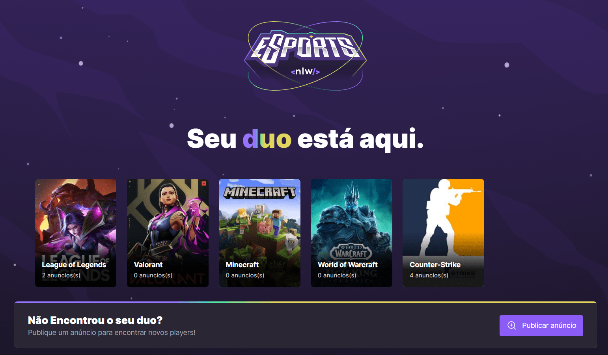

# Find Your Duo

<!---Esses são exemplos. Veja https://shields.io para outras pessoas ou para personalizar este conjunto de escudos. Você pode querer incluir dependências, status do projeto e informações de licença aqui--->

Help gamers to find a duo to play with!
Done during NLW e-sport course by RocketSeat.
There is a web and a mobile version, as well as the server that you may find in the submodules references.

# Stacks
- Backend: NodeJs
- Frontend-web: React
- Fontend-mobile: React Native
